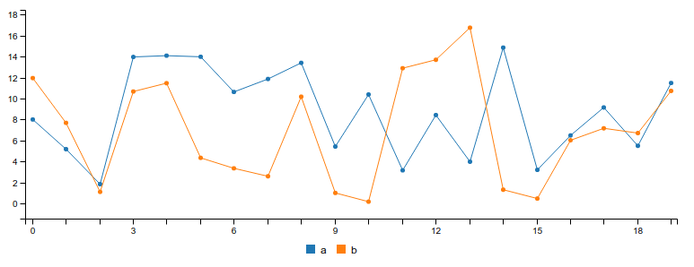

c3
================

[](https://zenodo.org/badge/latestdoi/60614778)
[](https://travis-ci.org/mrjoh3/c3)
[](https://codecov.io/gh/mrjoh3/c3)
[](http://cran.r-project.org/package=c3/)
[](http://cran.r-project.org/package=c3)
[](http://www.rdocumentation.org/packages/c3)

The `c3` package is a wrapper, or
[htmlwidget](http://www.htmlwidgets.org/), for the
[C3](http://c3js.org/) javascript charting library by [Masayuki
Tanaka](https://github.com/masayuki0812). You will find this package
useful if you are wanting to create a chart using
[R](https://www.r-project.org/) and embedding it in a Rmarkdown document
or Shiny App.

The `C3` library is very versatile and includes a lot of options.
Currently this package wraps most of the `C3` [options
object](http://c3js.org/reference.html).

## Installation

You probably already guessed this bit.

``` r

install.packages('c3')

# OR

devtools::install_github("mrjoh3/c3")
```

## Basic Usage

The `c3` package is intended to be as simple and lightweight as
possible. As a starting point the data input must be a `data.frame` or
`tibble` with several options.

Where no options are supplied a simple line plot is produced by default.
Where no x-axis is defined the plots are sequential. `Date` x-axis can
be parsed with not additional setting if in the format `%Y-%m-%d` (ie
‘2014-01-01’)

``` r

library(c3)

data <- data.frame(a = abs(rnorm(20) * 10),
                   b = abs(rnorm(20) * 10),
                   date = seq(as.Date("2014-01-01"), by = "month", length.out = 20))

c3(data)
```



## Documentation

For more detailed documentation and methods see
<http://mrjoh3.github.io/c3/>.
