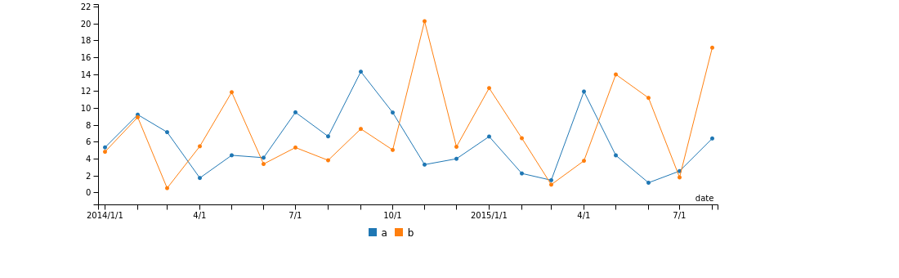
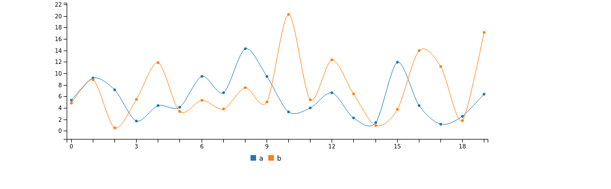
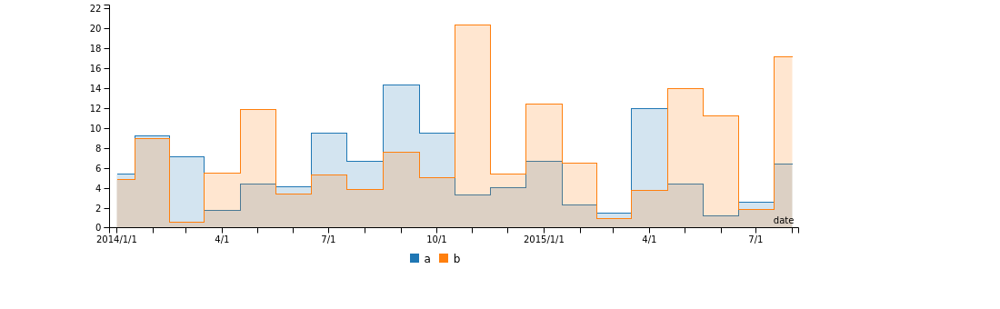
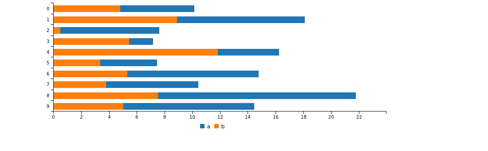
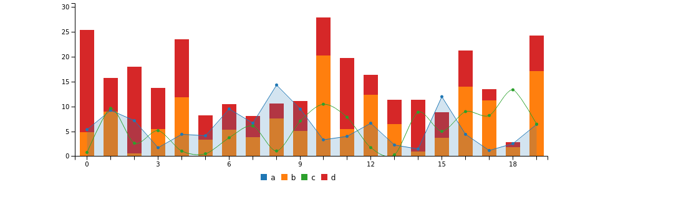
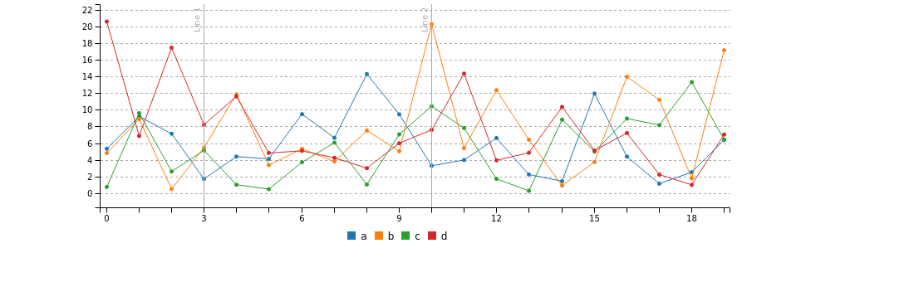
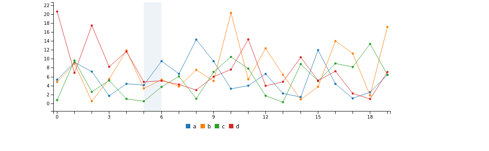

# c3


The `c3` package is a wrapper, or [htmlwidget](http://www.htmlwidgets.org/), for the [c3](http://c3js.org/) javascript charting library by [Masayuki Tanaka](https://github.com/masayuki0812). You will find this package useful if you are wanting create a chart using [R](https://www.r-project.org/) for embedding in a Rmarkdown document or Shiny App.  

The `c3` library is very versatile and includes a lot of options. Currently this package wraps most of the [options object](http://c3js.org/reference.html). Even with this current limitation a wide range of options are available. 

## Warning

This package is under active development and will definitely change. All attempts will be made to maintain the functionality and methods demonstrated in this document. Documentation is currently a work in progress. 

Any suggestions, advice or requests are welcome. For any bugs (there will be bugs) please submit an [issue](https://github.com/mrjoh3/c3/issues).


## Installation

You probably already guessed this bit.


```r
devtools::install_github("mrjoh3/c3")
```


## Usage

Please note that this package is under active development and may change at any time. The plots that currently work are line (and varieties), bar and scatter plots. Where possible the package tries to emulate the [Grammer of Graphics](https://books.google.com.au/books?id=ZiwLCAAAQBAJ&lpg=PR3&dq=inauthor%3A%22Leland%20Wilkinson%22&pg=PR3#v=onepage&q&f=false) used in Hadley Wickham's [ggplot2](http://ggplot2.org/).

The `c3` package is intended to be as simple and lightweight as possible. As a starting point the data input must be a `data.frame` with several options. 

  * If a `data.frame` without any options is passed all of the numeric columns will be plotted. This can be used in line and bar plots. Each column is a line or bar.
  * For more complex plots only 3 columns are used, those defined as `x`, `y` and `group`. This requires a `data.frame` with a vertical structure.

### The Basics

Where no options are supplied a simple line plot is produced by default. Where no x-axis is defined the plots are sequential. `Date` x-axis can be parsed with not additional setting if in the format `%Y-%m-%d` (ie '2014-01-01') 


```r
library(c3)

data = data.frame(a = abs(rnorm(20) * 10),
                  b = abs(rnorm(20) * 10),
                  date = seq(as.Date("2014-01-01"), by = "month", length.out = 20))

simple.plot <- c3(data)
```


```r
simple.plot.date <- c3(data, x = 'date')
```




### Piping

The package also imports the [migrittr](https://cran.r-project.org/web/packages/magrittr/vignettes/magrittr.html) piping function (`%>%`) to simplify syntax.


```r
piped.plot <- data %>%
                c3() 
```


## Other Line Plots

There are 5 different line plots available:

* line
* spline
* step
* area
* area-step


#### Spline


```r
spline.plot <- data %>%
  c3() %>%
  c3_line('spline')
```





#### Step


```r
step.plot <- data %>%
  c3(x = 'date') %>%
  c3_line('area-step')
```





## Bar Plots


```r
bar.plot <- data[1:10, ] %>%
  c3() %>%
  c3_bar(stacked = TRUE, rotate = TRUE)
```





## Mixed Geometry Plots

Mixed geometry currently only works with a horixontal `data.frame` where each numeric column is plotted.


```r
data$c = abs(rnorm(20) *10)
data$d = abs(rnorm(20) *10)

mixed.plot <- data %>%
  c3() %>%
  c3_mixedGeom(type = 'bar',
               stacked = c('b','d'),
               types = list(a='area',
                            c='spline'))
```





## Scatter Plot


```r
scatter.plot <- iris %>%
  c3(x='Sepal_Length', y='Sepal_Width', group = 'Species') %>% 
  c3_scatter()
```


## Pie Charts


```r
pie.chart <- data.frame(sugar=20,fat=45,salt=10) %>% 
  c3() %>% 
  c3_pie()
```


## Donut Charts


```r
donut.chart <- data.frame(red=82,green=33,blue=93) %>% 
  c3(colors=list(red='red',green='green',blue='blue')) %>% 
  c3_donut(title = '#d053ee')
```


## Gauge Charts


```r
gauge.chart <- data.frame(data = 80) %>% 
  c3() %>% 
  c3_gauge()
```


## Grid Lines


```r
grid.plot <- data %>%
  c3() %>%
  grid('y') %>%
  grid('x', show=F, lines = data.frame(value=c(3,10), 
                                       text= c('Line 1','Line 2')))
```





## Region Highlighting

To highlight regions pass a single `data.frame` with columns `axis`, `start`, `end` and `class`. Multiple regions can be defined within the one `data.frame` for any axis (`x`, `y`, `y2`). Each row in the `data.frame` defines a separate region to be highlighted  


```r
region.plot <- data %>%
  c3() %>%
  region(data.frame(axis = 'x',
                    start = 5,
                    end = 6))
```





## Color Palette

Plot color palettes can be changed to either `RColorBrewer` or `viridis` palettes using either `RColorBrewer` (S3 method) or `c3_viridus`.


```r
pie.RColorBrewer <- data.frame(sugar = 20, fat = 45, salt = 10, vegetables = 60) %>% 
  c3() %>% 
  c3_pie() %>%
  RColorBrewer()
```


```r
pie.viridis <- data.frame(sugar = 20, fat = 45, salt = 10, vegetables = 60) %>% 
  c3() %>% 
  c3_pie() %>%
  c3_viridis()
```


